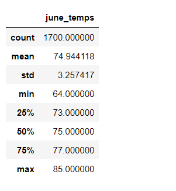
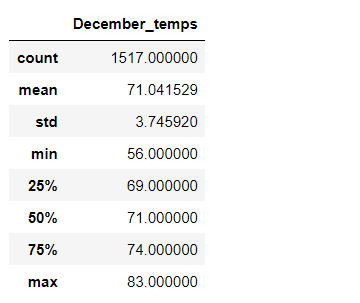

# surfs_up

## Overview

The purpose of this analysis is to compare the temparatures in different months and determine which month is best suit for surfing and icecream business.

## Analysis

- Here we are comparing the temperatures in month of June and December and determine the summary statistics on  the results obtained.
- The temperature for each month and year is stored in the sqllite database tables.
- sqlachemy is used to connect to database and extract the data
- There are two tables measurement and precipation which holds the weather data for the Oahu.
- From the measurement table date column is filtered for june month and temperatues for the june month is extracted from tobs column
- This data is stored in a list and statical analysis is performed.
- December statics is also derived by using above steps.

## Results

Below are the results determined after the analysis of data.

               

- The count in June month is 1700 whearas in December is 1517 which counts to around 10% reduction
- Minimum temp in June is 64 and December is 56
- Maximum temp in June is 85 and in December is 83 
- Standard deviation June is 3.3 and December is 3.7  respectively.

## Summary

From the above results it is evident that business has relatively higher number of sales in month of June and as the temperatures are also higher in June kids would crave for icecreams therby adding profit to the business.
In terms of surfing as well June appears to be promising however, during winter months there can be decline in the sales due to temperature drip. 

